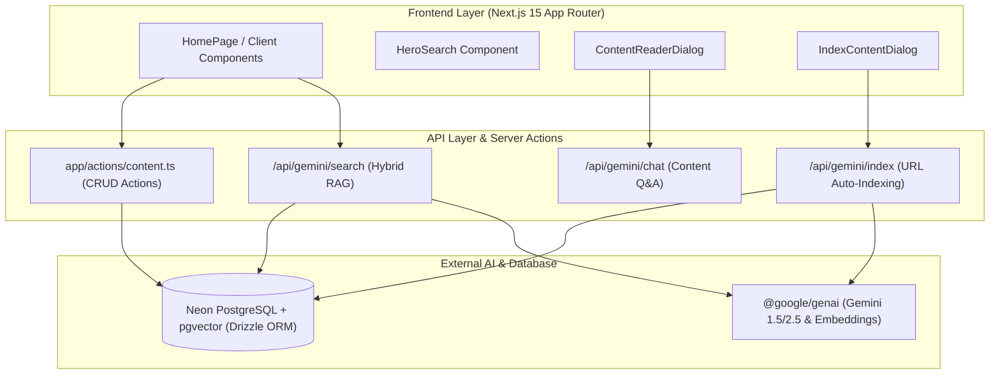

# ContentFinder-AI — System Architecture & Data Flow Overview

> **Module**: System Architecture  
> **Parent Document**: [2026-07-30-contentfinder-ai-design.md](../specs/2026-07-30-contentfinder-ai-design.md)

---

## 1. System Topology & Stack Interaction

---

## 2. Core Operational Workflows

### A. URL & Content Indexing Workflow
1. User submits a URL or raw article text via `IndexContentDialog`.
2. Client sends payload to `POST /api/gemini/index`.
3. Server invokes Gemini API with structured JSON output instructions to generate:
   - `summary` (2-3 concise sentences)
   - `keyTakeaways` (array of bullet strings)
   - `category` & `contentType` (`article` | `video` | `documentation` | `code_snippet` | `tutorial`)
   - `difficulty` (`Beginner` | `Intermediate` | `Advanced`)
   - `tags` (array of tag names)
4. Server generates text embedding (768d) using `text-embedding-004`.
5. Content record and vector embedding are transactionally saved into Neon DB via Drizzle ORM.
6. Newly indexed content item is returned to UI and dynamically added to state.

### B. Hybrid Search & Vector Reranking Workflow
1. User types query into `HeroSearch` (e.g., "drizzle ORM postgres migration setup").
2. Client sends query to `POST /api/gemini/search`.
3. Server executes Gemini Intent Analysis:
   - Extracts underlying goal, key concepts, target category filters, and difficulty preferences.
4. Server queries Neon DB using pgvector cosine distance (`embedding <=> queryVector` limit 20).
5. Candidates are sent through Gemini Reranker LLM pass to assign:
   - `matchScore` (0 to 100)
   - `matchExplanation` (1 sentence explaining why this item satisfies user query)
6. Scored items and intent payload returned to UI, rendering `SearchIntentCard` and updated `ContentGrid`.

---

## 3. Resilience & Degradation Strategy

| Failure Scenario | Fallback Action | User Impact |
| :--- | :--- | :--- |
| Gemini Embedding API Rate Limit / Failure | Fallback to PostgreSQL ILIKE keyword text search on `title` and `summary`. | Search still works, match score defaults to 70%. |
| Neon DB Connection Timeout | Fallback to mock in-memory seed items. | App remains interactive during DB maintenance. |
| Missing GEMINI_API_KEY | Graceful UI notification advising configuration in `.env`. | Search operates in basic keyword mode. |
