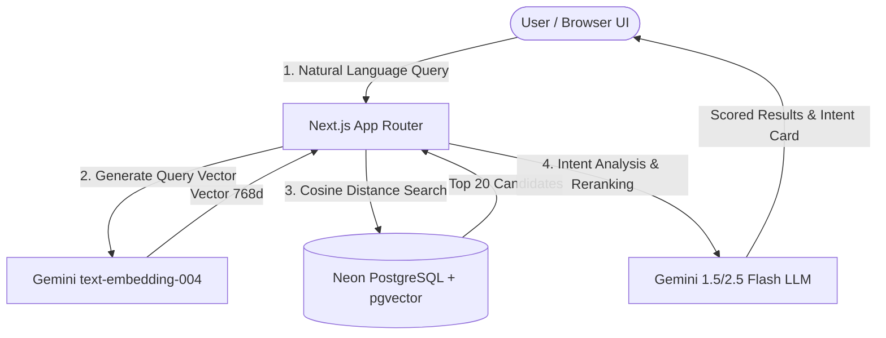

# ContentFinder-AI — Superpowers Master Design Specification

> **Date**: 2026-07-30  
> **Status**: Approved Design  
> **Architecture**: Modular Hybrid RAG (pgvector + Gemini Semantic Reranking)  
> **Stack**: Next.js 15 (App Router), React 19, TypeScript, Drizzle ORM, Neon PostgreSQL, Tailwind CSS v4, Motion, @google/genai

---

## 1. Executive Summary & Product Vision

**ContentFinder-AI** is an intelligent knowledge base and AI-driven content discovery engine. It allows users to index external learning resources (articles, technical documentation, YouTube/video tutorials, code snippets), auto-summarize key takeaways via Gemini AI, perform hybrid vector semantic searches with real-time match explanations, and organize curated items into smart collections.

### Core Objectives
1. **Instant Knowledge Indexing**: Turn any URL or raw text into a structured, searchable knowledge node complete with Gemini-generated summaries, key takeaways, difficulty rating, and tags.
2. **Intent-Aware Hybrid Search**: Combine hard database filters & vector similarity search with Gemini LLM intent analysis to deliver contextually ranked search results.
3. **Personal Knowledge Management**: Enable bookmarked collections, custom notes, and an AI chat assistant for asking natural language questions over indexed content.

---

## 2. Target User Persona & Key User Stories

### Target User
Developers, researchers, and content creators needing a central repository for technical articles, documentation, and tutorials with instant semantic search capability.

### Key User Stories
- **As a user**, I want to paste a URL or article text so Gemini AI can extract key takeaways, assign difficulty levels, and index it automatically.
- **As a user**, I want to search using natural language (e.g., "how to optimize Next.js server components cache") and get items ranked by semantic relevance with AI match explanations.
- **As a user**, I want to save indexed content into custom themed collections for quick offline/saved access.
- **As a user**, I want an interactive AI reader dialog to read articles and inspect key takeaways in a distraction-free view.

---

## 3. High-Level System Architecture

For detailed diagrams and component data flow, see [system-overview.md](file:///d:/Project/Web%20Project/Enuma/AIContentFinder/ContentFinder-AI/docs/superpowers/architecture/system-overview.md).

---

## 4. UI/UX Design System & Principles

### Aesthetic Direction
- **Modern Dark & Light Mode**: Fluid slate/zinc color palette with HSL-tailored accents (`indigo-600` hero accents, glassmorphic backdrop filters).
- **Typography**: Clean sans-serif typography hierarchy using modern system fonts and standard responsive scaling.
- **Micro-Animations**: Framer Motion transitions for intent card entrance, dialog backdrop fades, and subtle card hover effects.
- **Feedback & Toasts**: Sonner toast notifications for search expansions, bookmarking actions, and indexing progress.

---

## 5. Superpowers Documentation Suite Map

This design spec is accompanied by modular documentation files located in `docs/superpowers/`:

- 📐 **Master Spec**: [2026-07-30-contentfinder-ai-design.md](2026-07-30-contentfinder-ai-design.md)
- 🏗️ **Architecture & Data Flow**: [system-overview.md](../architecture/system-overview.md)
- 🔌 **API & Gemini Vector Specs**: [gemini-vector-endpoints.md](../api/gemini-vector-endpoints.md)
- 🗄️ **Database & Schema**: [schema-spec.md](../database/schema-spec.md)
